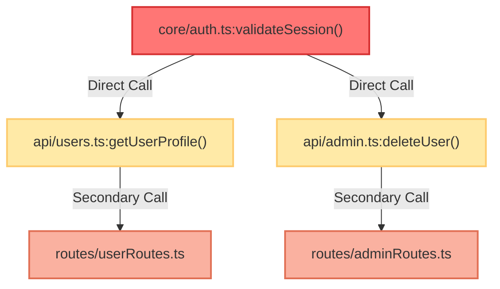

# 🚀 Ground-Breaking Feature Proposal: AI Mind Map Website

This document outlines five ground-breaking, premium features to elevate the **AI Mind Map** ecosystem from a smart landing page to an indispensable, state-of-the-art developer intelligence platform.

---

## 🗺️ 1. Interactive PR Blast Radius Simulator (Visual Impact Analysis)

> [!IMPORTANT]
> **The Problem:** Developers and reviewers struggle to predict the ripple effects of code changes in a complex system. Standard git diffs show *lines of text changed*, but not *behavioral connections broken*.

### 💡 How It Works on the Website:
1. **Input Interface:** In the Playground or Explorer page, a new **"Blast Radius"** tab is added. The user can either paste a git diff, specify a branch name, or search for a specific function/class node in the graph.
2. **Visual Propagation:** The D3 graph instantly switches to "Impact View."
   - The selected/changed node glows in **pulsating neon red**.
   - Directly affected nodes (first-level callers) light up in **neon orange**.
   - Indirectly affected nodes (recursive dependencies) light up in **warm amber**, with the connections drawn as animated, moving pulse lines showing the flow of impact.
3. **Sidebar Analytics:** The sidebar compiles an "Impact Report" detailing:
   - **Total Blast Radius:** "X files, Y functions, and Z routes affected."
   - **High-Risk Nodes:** Highly central nodes (high PageRank) affected by the change.
   - **Broken Contract Alerts:** Warns if public method signatures are altered.

### 🛠️ Value for Developers:
- **Zero-Guesswork PR Reviews:** Reviewers can instantly see the exact architectural footprint of any pull request.
- **Fearless Refactoring:** Developers can test changes in theory before touching a line of code.

---

## 📊 2. Codebase Cognitive Complexity & Centrality Heatmap

> [!TIP]
> **The Problem:** Traditional static-analysis tools list complex files in a boring spreadsheet. They fail to highlight *critical complexity*—a complex file that is also highly central to the application.

### 💡 How It Works on the Website:
1. **Interactive Lens:** A toggle named **"Complexity Lens"** is added to the Explorer.
2. **Dimensional Mapping:**
   - **Node Color (Complexity):** Represents Cognitive Complexity (Halstead/McCabe metrics). Simple files are cool **cyan/green**, moderately complex are **yellow**, and highly complex spaghetti-code files glow in **pulsating magenta/red**.
   - **Node Size (Centrality):** Represents PageRank score (how many other files import or depend on this node).
3. **The "Danger Zone" Quadrant:** The sidebar plots nodes on a 2D scatter graph:
   - **High Complexity + High Centrality (Top Right):** Labeled **"Danger Zone"**. These are highly complex files that the entire app depends on. They are the primary source of bugs and technical debt.
   - **High Complexity + Low Centrality:** Labeled **"Refactor Candidates"**.
   - **Low Complexity + High Centrality:** Labeled **"Stable Foundations"**.

### 🛠️ Value for Developers:
- **Instant Technical Debt Auditing:** Teams can spot exactly which refactoring tasks will yield the highest ROI for codebase stability.

---

## 🛡️ 3. Interactive Architecture Decision Record (ADR) & Rule Editor

> [!NOTE]
> **The Problem:** AI Mind Map supports memory tools (`mindmap_decide`, `mindmap_remember`). However, developers have no visual way of knowing what rules their AI agent is currently following, leading to a "black box" feeling.

### 💡 How It Works on the Website:
1. **The Brain Dashboard:** A dedicated **"Memory Panel"** page.
2. **Visual Memory Map:**
   - **Semantic Timeline:** Renders a clean chronological timeline of all decisions made using `mindmap_decide`.
   - **Category Buckets:** Groups rules and context (e.g., Coding Styles, Security, Database schemas, API routes) into modern card grids.
3. **Interactive Control:**
   - Developers can edit, prune, add, or toggle rules in real-time via the web interface.
   - Includes a **"Sync to Agent"** button which exports the configuration back to the local SQLite database.
4. **AI Alignment Simulator:** Allows testing a rule against a mock prompt to preview how the agent would respond before committing it to memory.

### 🛠️ Value for Developers:
- **Full transparency:** Developers have absolute control over what the AI "remembers" and "knows" about the codebase.

---

## 🧬 4. Dead Code & Circular Dependency Cycle Finder

> [!WARNING]
> **The Problem:** Circular dependencies create memory leaks and bundling issues, while dead code bloats the repository and increases AI token consumption.

### 💡 How It Works on the Website:
1. **Visual Cycle Highlighter:** The website analyzes the D3 graph to detect cycles (e.g., `fileA.ts` imports `fileB.ts` imports `fileC.ts` imports `fileA.ts`).
   - If a cycle is detected, the participating nodes are grouped in a **neon-yellow boundary ring** on the D3 graph, with animated arrows pointing along the cycle path.
2. **Dead Code Visualizer:** Nodes with PageRank = 0 (and no incoming links) are faded out or shown as ghost nodes.
3. **Actionable Suggestions:** Clicking a cycle or a dead node provides an AI-suggested refactoring strategy (e.g., "Extract shared types to a common interface file").

### 🛠️ Value for Developers:
- **Lighter Bundles:** Easy removal of obsolete code.
- **Architectural Health:** Instant resolution of compiler/bundler circular reference warnings.

---

## 📈 5. Data-Driven AI Token & Cost Audit Profiler

> [!TIP]
> **The Problem:** The current token calculator uses generic sliders. Developers want to know the *exact* financial ROI they will get by deploying AI Mind Map on *their specific repositories*.

### 💡 How It Works on the Website:
1. **Scan & Profile:** On the Playground page, when a user indexes their repo, the page generates a personalized **AI Cost Profile**.
2. **Repository Analysis:**
   - Calculates the average file size and token counts.
   - Queries the GitHub API for commit history to estimate the team's daily edit/read frequency.
   - Calculates the exact percentage of redundant file reads based on import relationships.
3. **Stunning ROI Dashboard:**
   - **\"Waste Meter\":** Visualizes the monthly dollar amount wasted on repetitive file reads.
   - **\"Savings Projection\":** Shows the monthly cost with AI Mind Map (e.g., "Current Monthly Cost: $180/dev. With AI Mind Map: $6.30/dev. Savings: 96.5%").
   - Generates a shareable PDF report for tech leads/CTOs.

### 🛠️ Value for Developers:
- **Business Justification:** Provides concrete, data-backed financial reasons to adopt AI Mind Map across engineering organizations.
